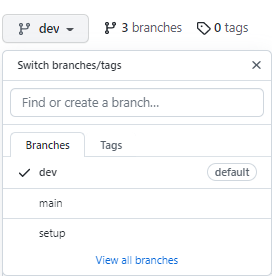
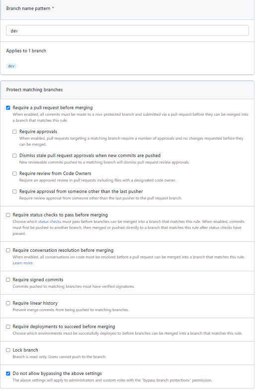
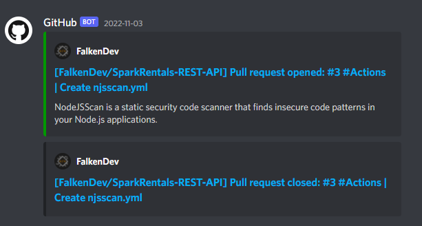

# How to Use GitHub in a Team

## Setting Up the Project in Your Local Folder

### Solution 1

The first thing you need to do is create a folder on your local computer that you want to use for your repository. Then, you need to initialize the folder with git, link it to the repository, and set a main branch.

<pre>git init</pre>
<pre>git remote add origin git@github.com:<b>YourRepositoryHere</b></pre>
<pre>git branch -M dev</pre>

I set the main branch to `dev` because that's where all implementations will be sent. See the **Branches** section for why I named it `dev`.

If there's already content on the main branch or another branch that you need to use, you'll need to fetch the content from that branch to avoid behind commits. Do this with pull:

<pre>git pull origin <b>dev</b></pre>

Where `dev` is the branch you want to fetch all data from.

### Solution 2

You can also just clone the repo you have created in github and use it

<pre>git clone git@github.com:<b>YourRepositoryHere</b></pre>
<pre>git branch -M dev</pre>

## Branches

Using multiple branches facilitates feature implementation within a team and avoids damaging the main branch where the program is functional. In our group, V-Team Group 1, we have set up 2 main branches, while feature implementations are done in new branches that are deleted once completed, reviewed, and merged into the `dev` branch.

### The Branches We Use:

- `main` (For major releases from the `dev` branch, ensuring runnable code with no major bugs)
- `dev` (For implementing features and fixing bugs)
- Feature or Backlog branches - For each feature being implemented, e.g., a "setup" branch for initializing the program. These branches are removed after pushing your project and creating a Pull Request reviewed and merged into the `dev` branch if everything is correct and GitHub Actions shows no warnings.

### How to Create a Branch for Each Feature:

Create a branch for each feature implementation:

<pre> git checkout -b featureName </pre>

Where `featureName` is the name of the feature being implemented. The `-b` flag is a convenience that tells Git to run `git branch` before `git checkout`.

After creating a new branch for the feature implementation, you're ready to start coding. Once done:

<pre>git status
git add "files you've changed"
git commit -m "Description of changes"
git push -u origin featureName</pre>

Fetch updates from `dev` to ensure you're up to date:

<pre>git pull origin dev</pre>

Then, create a pull request by following the link provided after pushing, or manually on GitHub.

Title your pull request with the feature and backlog ID, e.g., _#3 Implemented sidebar_, and provide a brief description. After review, if the feature is complete, delete the branch:

<pre>
git checkout dev
git pull origin dev
git branch -D featureName
</pre>

Remember to pull updates regularly, especially after merges, to keep your local repository up to date.

## Settings

Setting rules on branches, such as requiring pull requests for merges, can be beneficial. In our group, we've configured rules for both `main` and `dev` branches, including locking `main` to prevent direct pushes and setting `dev` as the default branch for easier pull requests and updates. You can set the rules in Github Settings in the Repo.

The bottom image shows which branch is set to default and which branches have protection rules on.

Here I use protection rules for branch dev. In this bracnh you have to make a pull request to be able to merge your branch to the default branch main. I have also set that you cannot bypass the pull request.

## Webhooks

Webhooks are useful for integrating with tools like Discord for team notifications, such as reviews or updates. They send notifications from GitHub to the specified Discord channel. For setting up, refer to tutorials like jagrosh's guide on GitHub webhooks: https://gist.github.com/jagrosh/5b1761213e33fc5b54ec7f6379034a22

**_Note: More information on working with GitHub as a team will be added to this markdown file as time permits._**
